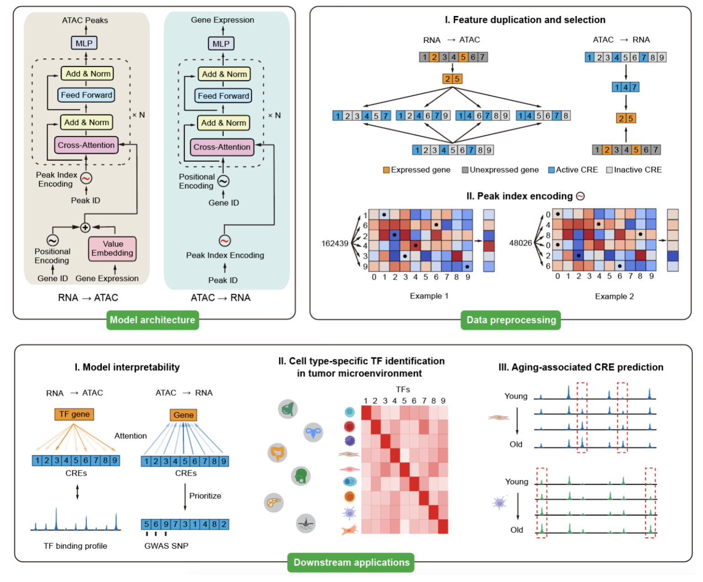

# Translation of Single-Cell Data Across Modalities with **Cisformer**


## About
**Cisformer** is a novel cross-modal deep learning model based on the Transformer architecture. It enables **bidirectional prediction and association between cis-regulatory elements and genes** at the single-cell level, with high efficiency and accuracy.

To meet real-world application needs and improve model performance:
- For the RNA2ATAC task, a trained Cisformer can generate high-quality scATAC-seq data from scRNA-seq inputs.
- For the ATAC2RNA task, the model can generate pseudo-scRNA-seq data and construct a highly accurate cis-regulatory interaction matrix between cis-elements and genes.

## Documentation
For detailed usage and examples, see the [official documentation]().  
If you encounter any issues, feel free to open an [issue](https://github.com/qihang-zou/Cisformer/issues).

## Environment Setup

### Miniconda3
We recommend using [Miniconda3](https://www.anaconda.com/docs/getting-started/miniconda/main) or [Anaconda](https://www.anaconda.com/) as the environment manager. Make sure `conda` is installed.

### Creating the Cisformer Environment
To get started, copy `requirement.sh` to your local server and run:
```bash
conda create -n cisformer python=3.10
conda activate cisformer
bash ./requirement.sh
```
Alternatively, you can install dependencies manually:
```bash
conda create -n cisformer python=3.10
conda activate cisformer
conda install numpy=1.23
conda install pytorch=2.2.1 torchvision=0.17.1 torchaudio=2.2.1 pytorch-cuda=12.1 -c pytorch -c nvidia
conda install -c conda-forge accelerate==0.22.0
conda install -c conda-forge scanpy python-igraph leidenalg
pip install ninja
pip install flash-attn --no-build-isolation
pip install torcheval
conda install tensorboard
conda install pybedtools
```

## Install from PyPI
```bash
pip install cisformer
```

---

# Quick Start

## Generate Default Config Files
```bash
cisformer generate_default_config
```
This command will create a folder named `cisformer_config` in the current directory, containing the following config files:
- `accelerate_config.yaml`
- `atac2rna_config.yaml`
- `rna2atac_config.yaml`

Cisformer uses [Hugging Face Accelerate](https://huggingface.co/docs/accelerate/index) for distributed training. You may need to modify `cisformer_config/accelerate_config.yaml` based on your server setup. See [Accelerate launch docs](https://huggingface.co/docs/accelerate/basic_tutorials/launch) for more information.

## RNA ➝ ATAC

### 1. Configure Parameters (Optional)
Edit the RNA2ATAC configuration file:
- `cisformer_config/rna2atac_config.yaml`  
Refer to the [documentation]() for parameter explanations.

### 2. Data Preprocessing
Cisformer requires raw scRNA-seq and scATAC-seq data in [Scanpy `.h5ad` format](https://scanpy.readthedocs.io/en/stable/tutorials/index.html).

To preprocess:
```bash
cisformer data_preprocess -r test_data/rna.h5ad -a test_data/atac.h5ad -s preprocessed_dataset
```
- `-r`: path to RNA `.h5ad` file  
- `-a`: path to ATAC `.h5ad` file  
- `-s`: output directory  

See the [documentation]() for additional options and output file details.

### 3. Model Training
```bash
cisformer rna2atac_train -t preprocessed_dataset/cisformer_rna2atac_train_dataset -v preprocessed_dataset/cisformer_rna2atac_val_dataset -n rna2atac_test
```
- `-t`: path to training dataset  
- `-v`: path to validation dataset  
- `-n`: project name  

A `save` directory will be created (or can be customized using `-s`). Inside, you'll find a folder like `2025-05-12_rna2atac_test`, which contains the trained models. Typically, the model from the last epoch performs best.

Refer to the [documentation]() for more options and output explanations.

### 4. Prediction
```bash
cisformer rna2atac_predict -r preprocessed_dataset/test_rna.h5ad -m save/2025-05-12_rna2atac_test/epoch34/pytorch_model.bin
```
- `-r`: RNA `.h5ad` file for prediction  
- `-m`: trained model checkpoint

The predicted ATAC matrix will be saved to `output/cisformer_predicted_atac.h5ad` by default.  
See the [documentation]() for more.

---

## ATAC ➝ RNA

### 1. Configure Parameters (Optional)
Edit the ATAC2RNA configuration file:
- `cisformer_config/atac2rna_config.yaml`

See the [documentation]() for details.

### 2. Data Preprocessing
```bash
cisformer data_preprocess -r test_data/rna.h5ad -a test_data/atac.h5ad -s preprocessed_dataset --atac2rna
```
- `--atac2rna` flag indicates this is for the ATAC2RNA direction  
Other arguments are the same as in RNA2ATAC.

### 3. Model Training
```bash
cisformer atac2rna_train -d preprocessed_dataset/cisformer_atac2rna_train_dataset -n atac2rna_test
```
- `-d`: path to ATAC2RNA training dataset  
- `-n`: project name

A `save` directory will be created (or customized with `-s`). The folder `2025-05-12_atac2rna_test` will contain the trained model, with the final epoch model usually performing best.

### 4. Prediction (Optional)
```bash
cisformer atac2rna_predict -d preprocessed_dataset/cisformer_atac2rna_test_dataset/atac2rna_0.pt -m save/2025-05-12_atac2rna_test/epoch30/pytorch_model.bin
```
- `-d`: path to test dataset `.pt` file  
- `-m`: trained model checkpoint

Output will be saved to `output/cisformer_predicted_rna.h5ad`.

### 5. Link cis-regulators and Genes
```bash
cisformer atac2rna_link -d preprocessed_dataset/cisformer_atac2rna_test_dataset/atac2rna_0.pt -m save/2025-05-12_atac2rna_test/epoch30/pytorch_model.bin -c test_data/celltype_info.tsv
```
- `-d`: test `.pt` file (must be accompanied by `cell_info.tsv` in the same folder)  
- `-m`: trained model  
- `-c`: TSV file mapping each cell barcode to a cell type (no header)

Example of `celltype_info.tsv`:
```
GTACCGGGTATACTGG-1	CD14 Mono
ACTGAATGTCACCAAA-1	cDC2
AACCTTGCAAACTGTT-1	CD14 Mono
...
```

The output folder `output/cisformer_link` will contain `.h5ad` files linking cis-regulators to genes for each cell type.

---

## Acknowledgements
- [flash-attention2](https://github.com/Dao-AILab/flash-attention)
- [Hugging Face](https://huggingface.co/)