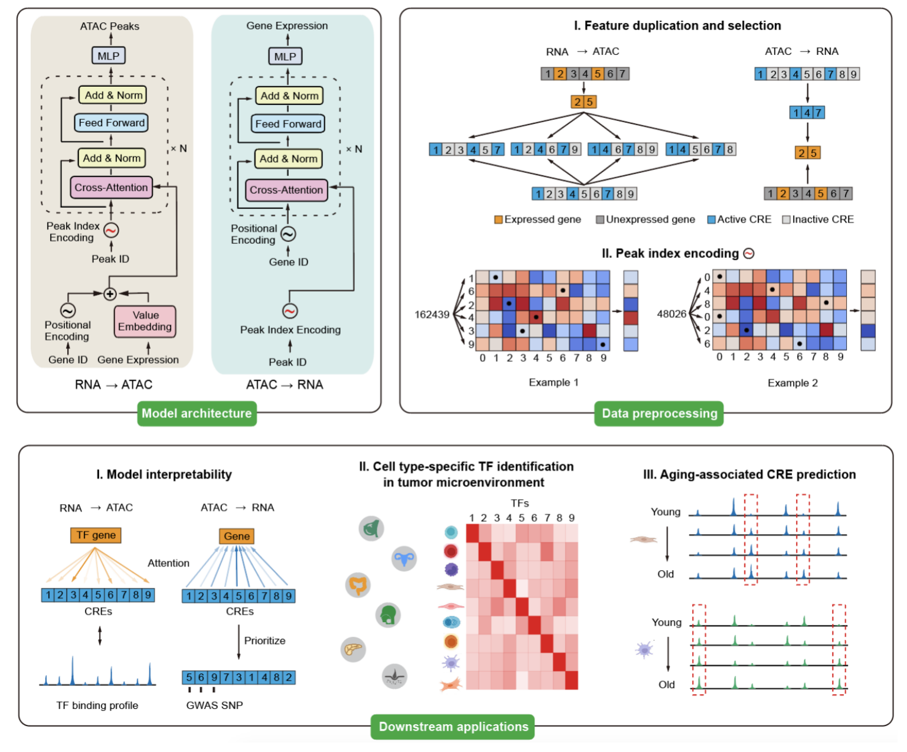

# Cisformer

[](https://pypi.org/project/cisformer)
[](https://cisformer.readthedocs.io/en/latest/?badge=stable)
[](https://pepy.tech/project/cisformer)



Cisformer is a Transformer-based framework for cross-modality generation between
single-cell RNA-seq and single-cell ATAC-seq. It supports RNA-to-ATAC generation,
ATAC-to-RNA generation, and cell-type-specific cis-regulatory element (cCRE)-gene
link inference from cross-attention.

The model uses a decoder-only cross-attention architecture designed for sparse,
ultra-long single-cell genomic sequences. In practice, Cisformer can be used to
predict a missing modality from an available assay and to extract interpretable
regulatory links from trained ATAC-to-RNA models.

## What's New in v1.1.0

- Added mouse support for preprocessing, config generation, prediction, and
  ATAC-to-RNA link analysis.
- Added species-aware default configs. Mouse configs use `total_gene: 23234`;
  human configs use `total_gene: 38244`.
- Added automatic log1p handling for ATAC-to-RNA preprocessing. Cisformer now
  checks the input scRNA-seq expression matrix and reports whether `log1p` is
  applied.
- Optimized preprocessing and ATAC-to-RNA link generation performance.
- Clarified that `atac2rna_link` outputs a rank-normalized link matrix. Values
  are ranking scores derived from valid attention scores, not raw correlation
  coefficients.

## Documentation

Full documentation is available at
[cisformer.readthedocs.io](https://cisformer.readthedocs.io/en/latest/).

## Installation

Cisformer does **not** currently rely on PyPI to install all runtime
dependencies automatically. Install the deep learning and genomics dependencies
in a conda environment first, then install the Cisformer command-line package
from PyPI:

```bash
conda create -n cisformer python=3.10
conda activate cisformer
bash ./requirement.sh
pip install cisformer
```

The PyPI package installs the `cisformer` command itself. Dependencies such as
PyTorch/CUDA, flash-attn, Scanpy, pybedtools, torcheval, tensorboard, and the
system bedtools backend should be installed according to your server
environment. See the installation guide in the documentation for the full
manual recipe.

## Quick Start

Generate default configuration files:

```bash
# Human, default
cisformer generate_default_config --species human

# Mouse
cisformer generate_default_config --species mouse
```

This creates `cisformer_config/` with:

- `accelerate_config.yaml`
- `atac2rna_config.yaml`
- `rna2atac_config.yaml`
- `resource/<species> Gencode annotation .gtf.gz`

Edit `accelerate_config.yaml` before distributed training, especially `gpu_ids`,
`num_processes`, and `main_process_port`.

Large Gencode annotation files are downloaded during this step and are not
bundled in the PyPI package. Human uses Gencode v49; mouse uses Gencode M39.

## Input Requirements

Cisformer expects paired scRNA-seq and scATAC-seq inputs in Scanpy `.h5ad`
format.

- RNA and ATAC cell barcodes must overlap.
- RNA features can be gene symbols or Ensembl IDs.
- ATAC features should be genomic peak coordinates in `chr:start-end` format.
- Set `--species human` or `--species mouse` consistently across preprocessing,
  config generation, prediction, and link inference.

## RNA-to-ATAC Workflow

Preprocess paired data:

```bash
cisformer data_preprocess \
  -r test_data/rna.h5ad \
  -a test_data/atac.h5ad \
  -s preprocessed_dataset \
  --species human
```

Train:

```bash
cisformer rna2atac_train \
  -t preprocessed_dataset/cisformer_rna2atac_train_dataset \
  -v preprocessed_dataset/cisformer_rna2atac_val_dataset \
  -n rna2atac_test
```

Predict ATAC from RNA:

```bash
cisformer rna2atac_predict \
  -r preprocessed_dataset/test_rna.h5ad \
  -m save/2025-05-12_rna2atac_test/epoch34/pytorch_model.bin \
  --species human
```

The output is saved as `output/cisformer_predicted_atac.h5ad` by default.

## ATAC-to-RNA Workflow

Preprocess paired data for ATAC-to-RNA:

```bash
cisformer data_preprocess \
  -r test_data/rna.h5ad \
  -a test_data/atac.h5ad \
  -s preprocessed_dataset \
  --atac2rna \
  --species human
```

During ATAC-to-RNA preprocessing, Cisformer inspects the loaded RNA matrix. If the
maximum expression value is `<= 10`, it applies `log1p`; if the maximum is `> 10`,
it assumes the matrix is already normalized and skips `log1p`. The decision is
printed to the terminal.

Train:

```bash
cisformer atac2rna_train \
  -d preprocessed_dataset/cisformer_atac2rna_train_dataset \
  -n atac2rna_test
```

Predict RNA from ATAC:

```bash
cisformer atac2rna_predict \
  -d preprocessed_dataset/cisformer_atac2rna_test_dataset/atac2rna_0.pt \
  -m save/2025-05-12_atac2rna_test/epoch30/pytorch_model.bin \
  --species human
```

The output is saved as `output/cisformer_predicted_rna.h5ad` by default.

## Link cCREs to Genes

After training an ATAC-to-RNA model, generate cell-type-specific link matrices:

```bash
cisformer atac2rna_link \
  -d preprocessed_dataset/cisformer_atac2rna_test_dataset/atac2rna_0.pt \
  -m save/2025-05-12_atac2rna_test/epoch30/pytorch_model.bin \
  -c test_data/celltype_info.tsv \
  --species human
```

`celltype_info.tsv` is a two-column, header-free TSV:

```text
GTACCGGGTATACTGG-1	CD14 Mono
ACTGAATGTCACCAAA-1	cDC2
AACCTTGCAAACTGTT-1	CD14 Mono
```

The command writes one `.h5ad` matrix per cell type under
`output/cisformer_link/`. Rows are genes and columns are cCREs. Non-zero matrix
entries are rank-normalized link scores: Cisformer first ranks valid
attention-derived cCRE-gene scores and then writes the ranked values. Treat these
as relative regulatory association scores, not raw attention values or Pearson
correlations.

## Pretrained Models

Pretrained models associated with the Cisformer paper are available from Zenodo:
[Pretrained_Models.zip](https://doi.org/10.5281/zenodo.16991152).

## Citation

If you use Cisformer, please cite:

Ji L, Zou Q, Tang K, Wang C. Cisformer: a scalable cross-modality generation
framework for decoding transcriptional regulation at single-cell resolution.
Genome Biology, 2025.

## Acknowledgements

- [flash-attention](https://github.com/Dao-AILab/flash-attention)
- [Hugging Face Accelerate](https://huggingface.co/docs/accelerate/index)
- [Scanpy](https://scanpy.readthedocs.io/)
