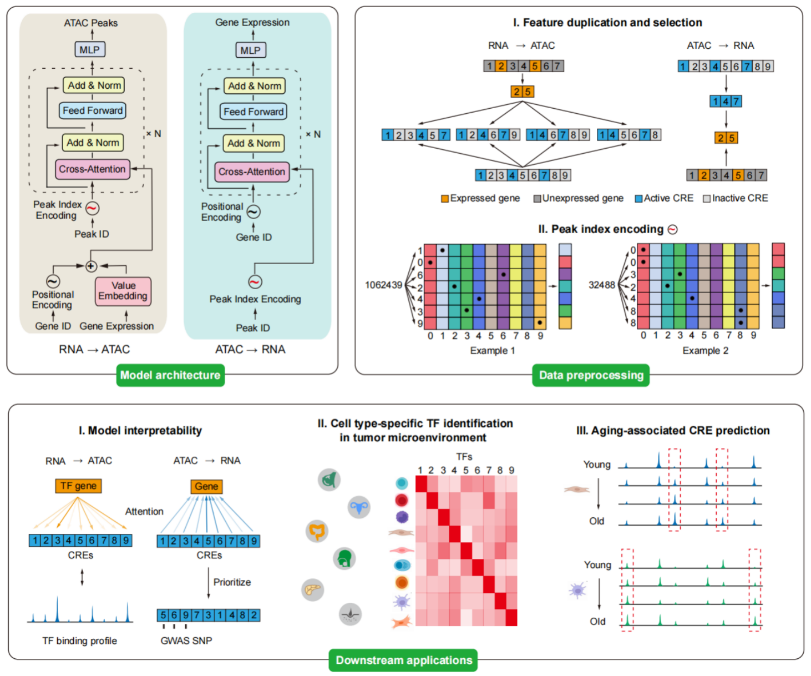

# Translation of Single-Cell Data Across Modalities with **Cisformer**


## About
**Cisformer** is a novel cross-modal deep learning model built upon the Transformer architecture. It enables **bidirectional prediction and association between cis-regulators and genes** at the single-cell level, with high efficiency and accuracy.

## Environment Setup
We recommend using [Miniconda3](https://www.anaconda.com/docs/getting-started/miniconda/main) or [Anaconda](https://www.anaconda.com/) as the environment manager. Please make sure `conda` is installed before proceeding.

Clone this repository and set up the environment as follows:
```bash
conda create -n cisformer python=3.10.15
conda activate cisformer
bash ./requirement.sh
```

---

# Quick Start

## RNA ➝ ATAC

### 1. Configure Parameters
You need three configuration files that differ mainly in their `datapreprocess` and `training` sections. Make sure the `model` section remains consistent across them:
- `args/rna2atac_config_train.yaml`
- `args/rna2atac_config_val.yaml`
- `args/rna2atac_config_test.yaml`

See the Cisformer documentation for detailed explanation of each parameter.

### 2. Data Preprocessing
Cisformer requires raw scRNA-seq and scATAC-seq matrices in [Scanpy `.h5ad` format](https://scanpy.readthedocs.io/en/stable/tutorials/index.html).

- **Split dataset** into training, validation, and test sets:
```bash
python split_train_val_test.py --RNA rna.h5ad --ATAC atac.h5ad --train_pct 0.7 --valid_pct 0.1
```

- **Convert h5ad to tensors** to speed up training and reduce memory usage:
```bash
python rna2atac_data_preprocess.py -r rna_train.h5ad -a atac_train.h5ad -s train_pt --dt train -n train --config rna2atac_config_train.yaml
python data_preprocess.py -r rna_val.h5ad -a atac_val.h5ad -s val_pt --dt val -n val --config rna2atac_config_val.yaml
python data_preprocess.py -r rna_test.h5ad -a atac_test.h5ad -s test_pt --dt test -n test --config rna2atac_config_test.yaml
```

### 3. Model Training
Cisformer leverages [Hugging Face Accelerate](https://huggingface.co/docs/accelerate/index) for distributed training. You may need to adjust `args/accelerate_config.yaml` based on your server configuration. See the [Accelerate documentation](https://huggingface.co/docs/accelerate/basic_tutorials/launch) for details.

Training command:
```bash
accelerate launch --config_file args/accelerator_config.yaml rna2atac_train.py --config_file rna2atac_config_train.yaml --train_data_dir train_pt --val_data_dir val_pt -s save -n rna2atac
```

### 4. Prediction
```bash
accelerate launch --config_file args/accelerator_config.yaml rna2atac_predict.py -d test_pt -l save/rna2atac/pytorch_model.bin --config_file rna2atac_config_test.yaml
```

---

## ATAC ➝ RNA

### 1. Configure Parameters
Edit the configuration file for this mode:
- `args/atac2rna_config.yaml`

Refer to the documentation for details on each parameter.

### 2. Data Preprocessing
Again, ensure your input data is in Scanpy `.h5ad` format. Then convert the input to `.pt` format:
```bash
python atac2rna_data_preprocess.py -r rna.h5ad -a atac.h5ad -s save_path -c args/atac2rna_config.yaml --atac2rna 
```

### 3. Model Training
Training command:
```bash
accelerate launch --config_file args/accelerate_config.yaml atac2rna_train.py -d save_path/cisformer_train_dataset -n atac2rna -c args/atac2rna_config.yaml
```

### 4. Prediction
```bash
python atac2rna_predict.py -d save_path/cisformer_test_dataset/10000-3000_0.pt -c args/atac2rna_config.yaml -l save/atac2rna/pytorch_model.bin -n predicted_rna
```

---

## Acknowledgements
- [flash-attention2](https://github.com/Dao-AILab/flash-attention)
- [Hugging Face](https://huggingface.co/)

---