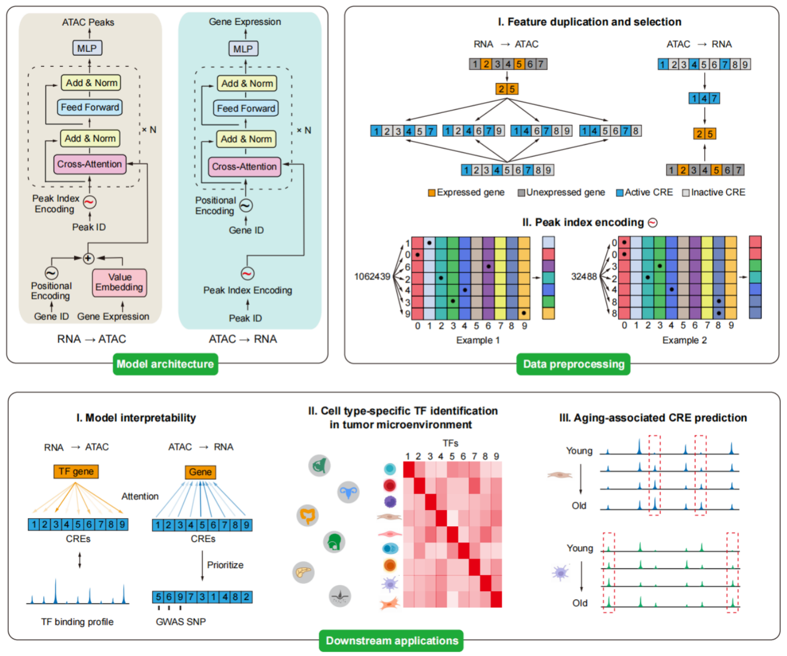

# Concept

Cisformer is a Transformer-based framework for cross-modality generation and
regulatory inference in single-cell RNA-seq and single-cell ATAC-seq data.

## What Cisformer Does

Cisformer supports three related tasks:

- **RNA-to-ATAC generation**: predict chromatin accessibility from scRNA-seq.
- **ATAC-to-RNA generation**: predict gene expression from scATAC-seq.
- **cCRE-gene link inference**: use ATAC-to-RNA cross-attention to infer
  cell-type-specific regulatory associations between cis-regulatory elements and
  genes.

## Model Rationale

Single-cell multiome assays can jointly measure gene expression and chromatin
accessibility, but paired profiling is more expensive and experimentally
constrained than single-modality assays. Cisformer addresses this by learning the
translation between transcriptome and chromatin accessibility profiles.

The method uses a decoder-only Transformer design with cross-attention. This
architecture avoids compressing genes or peaks into a low-dimensional latent
space before translation, which helps preserve feature-level interpretability.
For ATAC features, Cisformer uses an index encoding strategy to handle very long
peak vocabularies efficiently.

## Interpreting ATAC-to-RNA Links

The ATAC-to-RNA model predicts gene expression from accessible cCREs. During link
generation, Cisformer extracts cross-attention-derived scores for cCRE-gene pairs
within the configured genomic distance window and reports cell-type-specific
matrices.

The output values from `atac2rna_link` are **rank-normalized link scores**. They
are derived by ranking valid attention scores and writing the ranked values to a
sparse gene-by-cCRE matrix. They should be interpreted as relative association
strengths within the generated matrix, not as raw attention probabilities or
Pearson correlation coefficients.

## Species Support

Version 1.1.0 supports:

- `human`: 38,244 genes and 1,033,239 cCREs in the bundled reference.
- `mouse`: 23,234 genes and 262,853 cCREs in the bundled reference.

Use the same `--species` value when generating configs, preprocessing data,
running prediction, and generating links. Model checkpoints and configs are not
interchangeable across species unless they were trained with matching reference
vocabularies.
